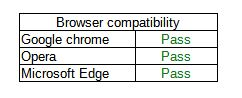
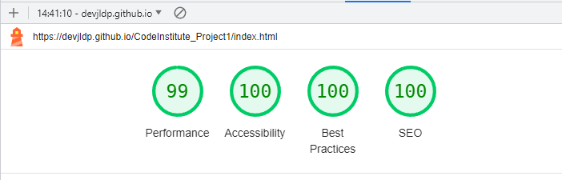
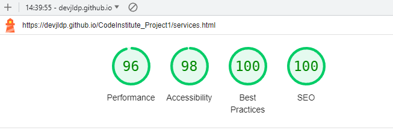
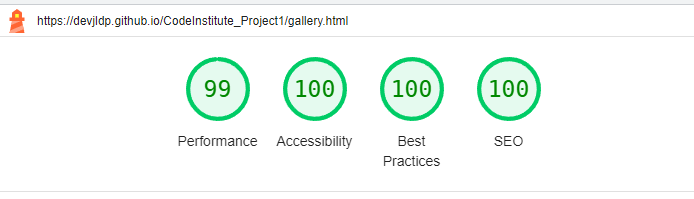
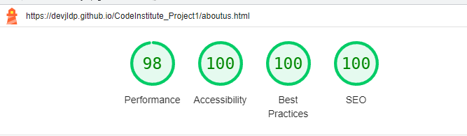
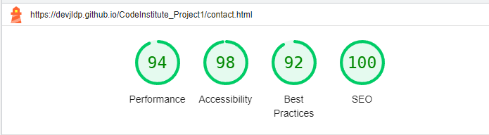

# Wedding: Wishes and Dreams.
  
# Introduction

Wedding: whises and dreams. This is a website project created for a fictional wedding planning company based in Cardiff, as part of the CodeInstitute course.
   
The purpose of the website is to establish an online presence for the company as the main source of information for customers about the business and its services.

  
# User Experience
## Business Goals:

As the owner of the wedding planning website, "Wishes and Dreams," our primary business goals are:

* To provide clear and comprehensive information about our wedding planning services, including package options, pricing, and the unique benefits we offer.
* To encourage couples to engage with our services by visiting our website, exploring their wedding planning needs, and offering the convenience of online booking and appointment scheduling.
* To showcase the quality and expertise of our wedding planning team, emphasizing our ability to bring couples' dreams to life and create unforgettable wedding experiences.
* To establish a strong online presence, increasing brand recognition and attracting a wider audience of engaged couples seeking professional wedding planning assistance.

## User Goals:

As users of the "Wishes and Dreams" website, our goals are to:

* Easily navigate the website and find relevant information about wedding planning services, including different planning packages, pricing details, and testimonials from satisfied couples.
* Seamlessly navigate between different pages and easily return to the home screen with a single click, ensuring a smooth browsing experience.
* Access the main navigation menu conveniently, whether at the top or bottom of the page, allowing quick and effortless exploration of various sections of the website.
* Enjoy a responsive design that adapts to different screen sizes, ensuring all information and images are easily viewable on desktops, tablets, and mobile devices.
* View high-quality images that showcase previous weddings planned by our team, capturing the beauty and creativity of our work, as well as inspirational ideas for their own wedding.
  
# User Stories:

  - ### As the business owner, I aim to:

    * Establish a strong online presence for "Wishes and Dreams" and expand our client base by reaching engaged couples seeking professional wedding planning services.
    * Inform potential clients about our comprehensive wedding planning services, including our expertise, personalized approach, and the exceptional experiences we create.
    * Provide a clear method of contact for potential clients to inquire about our services, ask questions, and book an initial consultation to discuss their wedding vision.

  - ### As a general user/customer of the website, I want to:

    * Find information about the various wedding planning services offered by "Wishes and Dreams," including the scope of assistance provided, pricing options, and the level of customization available.
    * Easily access essential details such as location, contact information, and working hours to engage with the team and plan a visit or consultation.
    * Explore the portfolio section, showcasing real weddings planned by "Wishes and Dreams," to gain inspiration and visualize the possibilities for my own dream wedding.

  - ### As a new user, I want to:

    * Understand the unique qualities that set "Wishes and Dreams" apart from other wedding planning services, such as our attention to detail, creative approach, and commitment to fulfilling couples' wishes and dreams.
    * Learn more about the team behind "Wishes and Dreams," their experience, credentials, and passion for creating unforgettable wedding experiences.
    * Have access to testimonials and reviews from past clients, validating the expertise and professionalism of "Wishes and Dreams" in delivering exceptional wedding planning services.
  
  
# Design of the website.

The website has been divided in 5 different pages.

* ### Home Page.
The home page features an elegant and minimalistic design, with a hero image and a call-to-action button that directs the user to the contact form. The navigation menu is placed on top of the page and is fixed to improve user experience.

* ### Services.
This page provides detailed information about the services that the company offers. It includes a description of services and packages.

* ### Gallery.
The photo gallery page displays a selection of photos from the company's previous wedding planning projects. The images are presented in a grid layout and can be clicked to enlarge. The page also features a search bar that allows the user to filter the photos based on specific keywords.

* ### About us.
The Meet the Team page showcases the company's team members and their roles in the wedding planning process. Each team member's profile is presented with their photo, name, and a brief description of their role. The page has a responsive design and adapts to different screen sizes.

* ### Contact.
The contact form page features a simple and user-friendly design, with fields for name, email, phone number, and message. The form has a validation feature that ensures all fields are filled correctly before submission.

## Fonts
The next fonts has been used: 
* Exo
* Monserrat alternates
* Roboto

## Technologies used.

* ### Languages Used
  * HTML
  * CSS

* ### Frameworks, Libraries & Programs Used
  * [Bootstrap v5.3](https://getbootstrap.com/): Bootstrap is a powerful, feature-packed frontend toolkit.
  * [Google Fonts](https://fonts.google.com/): was used to import the 'Lato' and 'Oswald' fonts into the style.css file which are used on all pages of the project.
  * [Font Awesome](https://fontawesome.com/): was used to add icons for aesthetic and UX purposes.
  * [Git](https://git-scm.com/): was used for version control by utilising the Gitpod terminal to commit to Git and Push to GitHub.
  * [GitHub](https://github.com/): is used as the respository for the projects code after being pushed from Git.
  * Microsoft Paint 3D: was used for resizing images and editing photos for the website.
  * [Balsamiq Wireframes](https://balsamiq.com/wireframes/): was used to create the wireframes during the design process.
  * [Visual Studio Code](https://code.visualstudio.com/): was used as code editor.

# Wireframes
All the wireframes from the design phase have been created using the following tool: [Balsamiq Wireframes](https://balsamiq.com/wireframes/)
* #### Landpage.

* #### Services page.

* #### Gallery page.

* #### About us page.

* #### Contact page.

# Testing

* [HTML Validator](https://validator.w3.org/) was run at several points during the project and small syntax errors identified were fixed. At the final stage no errors or warnings were found.  

  

* [CSS Validator](https://jigsaw.w3.org/css-validator/) was run several times during the project and picked up small syntax errors which were corrected. At the time of submission the css code successfully passed the validator with no errors.

## User Stories Testing

* Easy and intuitive navigation throughout the website. The page we are currently on is highlighted.  

* Display the menu when clicking on the mobile screen size.  

* Easily find the offered services and packages in a clear manner.  

* Links to the company's social media profiles.

* Be able to view sample images of previous works.  

* Validation form.
  

* Finding location and opening hours in contact page.

## Manual testing
* Responsiveness:  

* Broser compatibility:    

## Lighthouse

#### Before improvements:

The statistics in generral were good, however some imporvements were needed.

Some of the improvement I did were:
* Adding associated labels to form element
* Adding title to frame elements
* Adding aria-label to links element in the footer section
  Adding meta description to head

#### After improvements:  

# Deployment
The site was deployed to GitHub pages. The steps taken to deploy are as follows:

* Log in to [Github](https://github.com/)  
* Navigate to [devjldp/CodeInstitute_Project1](https://github.com/devjldp/CodeInstitute_Project1) in the list of repositories.  
* In the GitHub repository, navigate to the Settings tab.  
* In Settings scroll down to GitHub pages which opens in a new page.
* From the source section drop-down menu, select the Master Branch
* Once the master branch has been selected, the page is automatically refreshed and a display indicates the successful deployment and the link to the address.
* The link to the live website is here: [Wedding: Wishes and Dreams](https://devjldp.github.io/CodeInstitute_Project1/)

# Bugs
* The button that displays the menu on mobile size shows the menu, but it doesn't respond. The bug, which was caused by adding unnecessary Bootstrap scripts, has been fixed.  
* The menu displayed on mobile size appeared centered without alignment, displaying an untidy appearance. It has been fixed by aligning the text to the left.  
W* hen we are on the services page, the link is not displayed as active. The error was that the "active" class was missing.
* It is presumed that Chrome developer tools is in general not as accurate as the physical devices. In several cases what was displayed on the responsiveness testing in Chrome development tools was not exactly as appeared on actual devices so changes were always checked on actual devices for final approval.

 

# Credits

## Images
All images have been downloaded from: [Pixabay](https://pixabay.com/) and [Unsplash](https://unsplash.com/es).

#### Index
[Hero image](https://pixabay.com/es/photos/pareja-boda-matrimonio-nupcial-4615557/) - Pixabay by OlcayErtem
#### Services
[Garden wedding](https://unsplash.com/es/@jeremywongweddings) - Unsplash by Jeremy Wong Weddings
#### Gallery
[Beach wedding reception table](https://pixabay.com/es/photos/playa-boda-recepci%C3%B3n-1854076/) - Pixabay by Pexels.  
[Bride and groom couple](https://pixabay.com/es/photos/novia-y-novio-pareja-boda-sentar-768594/) - Pixabay by scottwebb.  
[Wedding reception table](https://pixabay.com/es/photos/recepci%C3%B3n-de-la-boda-1284245/) - Pixabay by Pexels.  
[Sunset wedding](https://pixabay.com/es/photos/atardecer-boda-siluetas-matrimonio-698501/) - Pixabay by StockSnap.  
[Event celebration table](https://pixabay.com/es/photos/evento-celebracion-6927353/) - Pixabay by Kleinheinz.  
[Wedding pool](https://unsplash.com/es/@alvarocvg) - Unsplash by AlvaroCvG.  
[Shoes](https://pixabay.com/es/photos/matrimonio-nupcial-boda-zapatos-636018/) - Pixabay by NGDPhotoworks.  
[Wedding venue](https://unsplash.com/es/fotos/fJzmPe-a0eU) - Unsplash by Shardayyy Photography/  
[Husband and wife](https://pixabay.com/es/photos/boda-pareja-matrimonio-1836315/) - Pixabay by Pexels.   
[Classic wedding](https://pixabay.com/es/photos/boda-matrimonio-marido-esposa-2595862/) - Pixabay by StockSnap.  
[Wedding bride asia](https://pixabay.com/es/photos/boda-novia-asia-vietnam-2784455/) - Pixabay by huynhthientu.  
[Wedding masks](https://unsplash.com/es/s/fotos/halloween-party) - Unsplash by Jonathan Borba

#### About us
[Roses on bench](https://pixabay.com/es/photos/rosas-rosas-rosadas-flores-1463562/) - Pixabay by congerdesign.  
[Sarah](https://pixabay.com/es/illustrations/caricatura-dise%C3%B1o-personaje-3222168/) - Pixabay by suscraft.  
[Emma](https://pixabay.com/es/illustrations/duende-bruja-fantas%C3%ADa-6914654/) - Pixabay by missartem.  

#### Response
[Flowers](https://pixabay.com/es/illustrations/floral-marco-dise%C3%B1o-flores-7005814/) - Pixabay by Mohamed_hassan

#### Web title icon
[wedding rings](https://pixabay.com/es/illustrations/anillos-joyer%C3%ADa-boda-oro-casar-2634929/) - Pixabay by MasterTux.